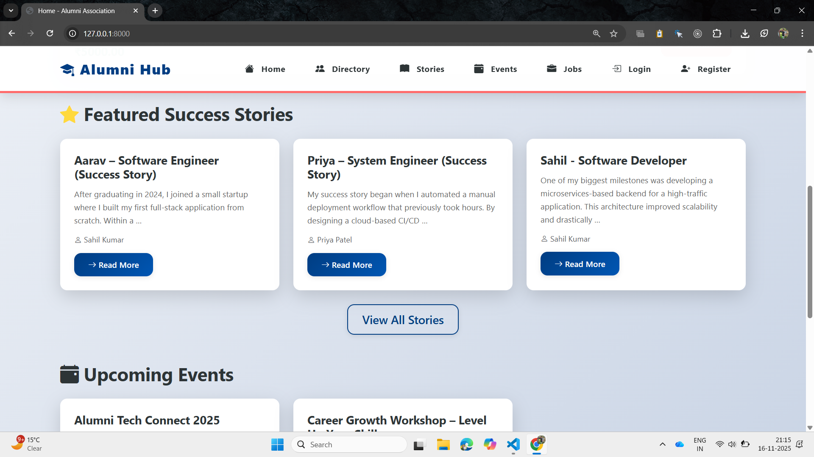
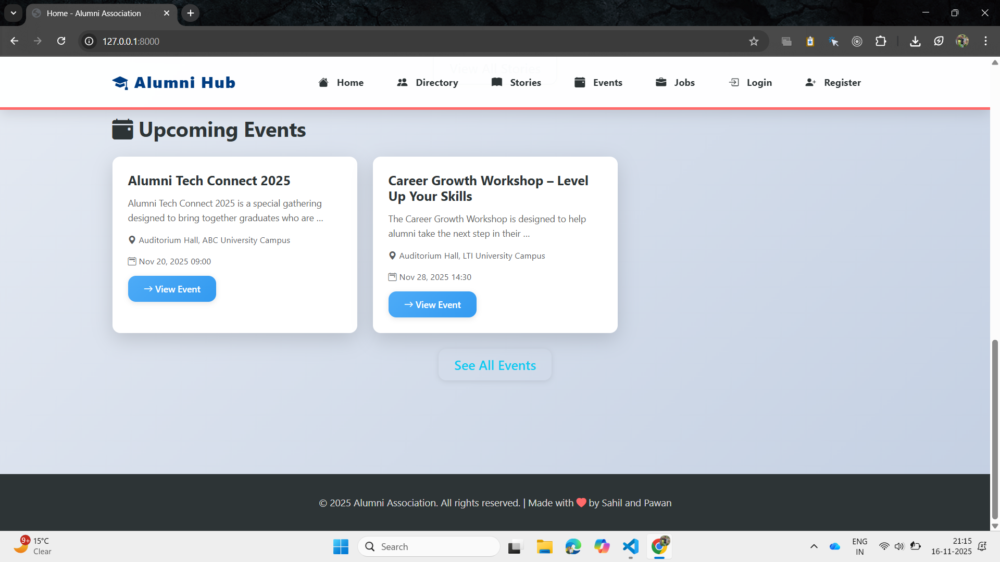
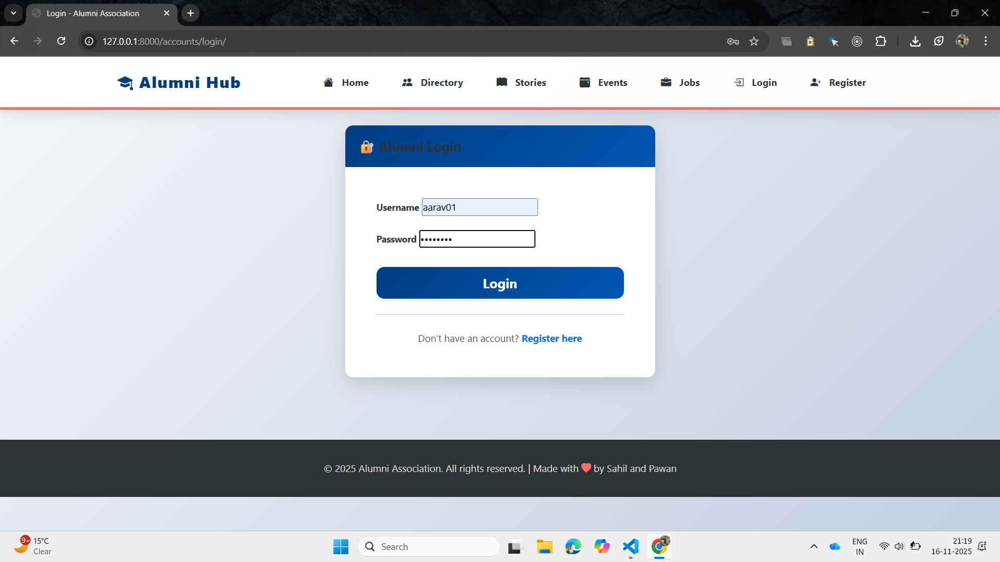
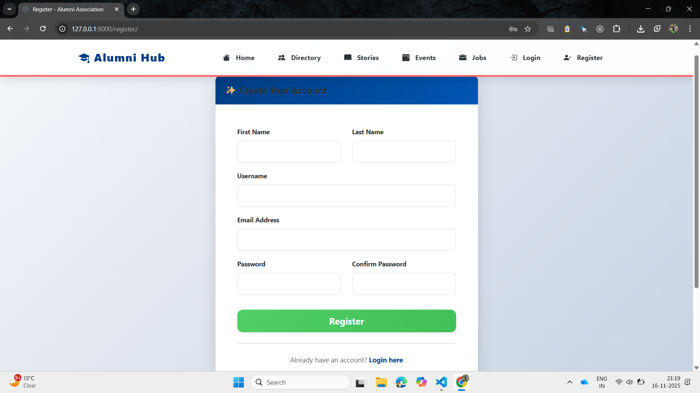
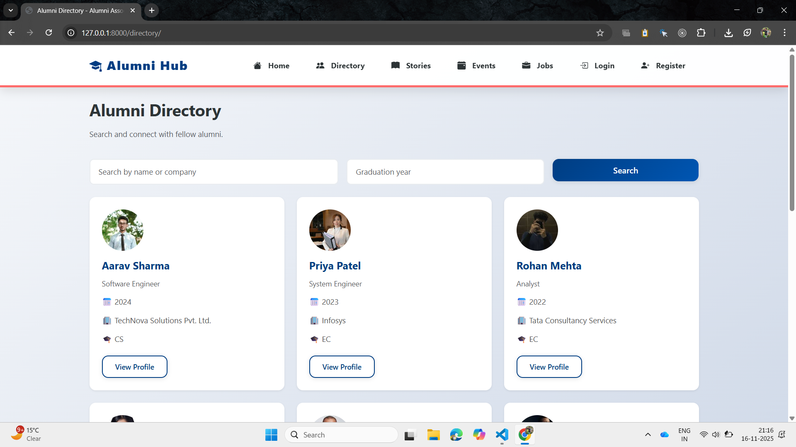
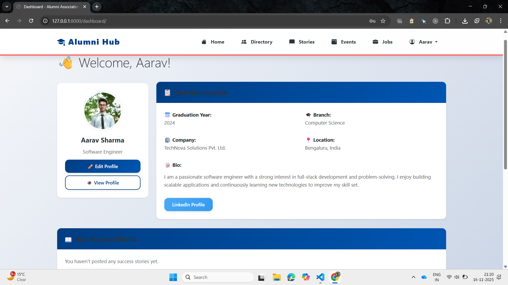
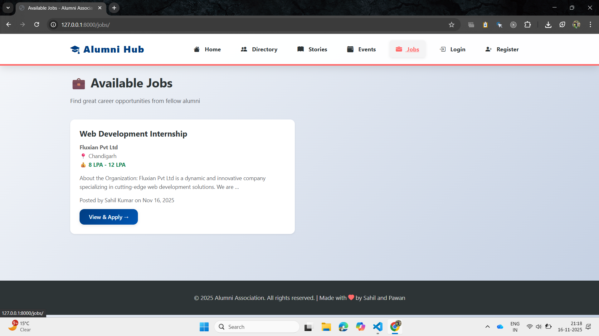
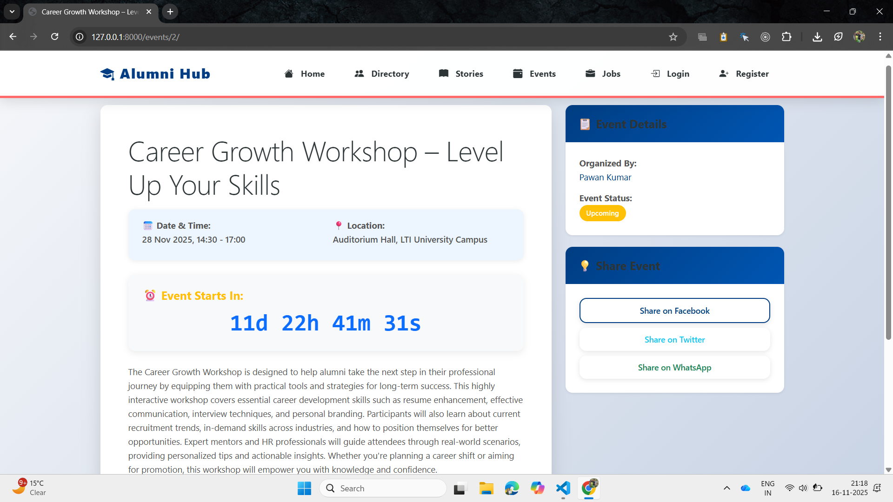
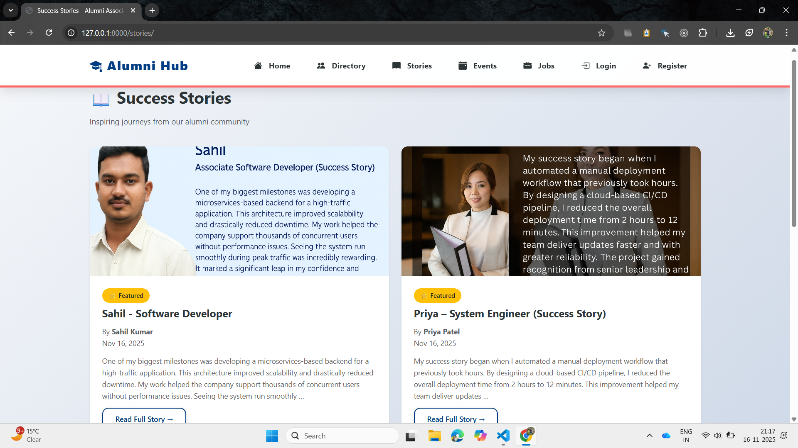
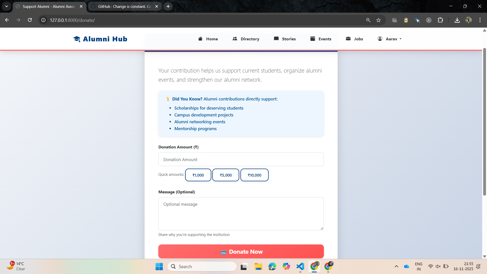

# 🎓 Alumni Association Platform

A comprehensive Django-based web application for managing alumni networks, job opportunities, events, and success stories for universities and educational institutions.

## 📋 Table of Contents

- [Features](#-features)
- [Tech Stack](#-tech-stack)
- [Installation](#-installation)
- [Configuration](#️-configuration)
- [Usage](#-usage)
- [Project Structure](#-project-structure)
- [Screenshots](#-screenshots)
- [Contributing](#-contributing)
- [License](#-license)
- [Support](#-support)

## ✨ Features

### User Management
- ✅ User Registration & Authentication
- ✅ Email-based Login
- ✅ Profile Management with Profile Picture
- ✅ User Dashboard

### Alumni Directory
- ✅ Search Alumni by Name, Company, Graduation Year
- ✅ Advanced Filtering Options
- ✅ Public Profile Viewing
- ✅ Pagination Support

### Job Portal
- ✅ Post Job Opportunities
- ✅ Apply for Jobs with Cover Letter
- ✅ Track Job Applications
- ✅ View Applicants (for Job Posters)
- ✅ Job Status Management (Active/Closed)

### Events Management
- ✅ Create & Manage Events
- ✅ Event Details with Location & Time
- ✅ Event Countdown Timer
- ✅ Event Status Tracking (Upcoming/Live/Completed)
- ✅ My Events Dashboard

### Success Stories
- ✅ Share Alumni Success Stories
- ✅ Add Featured Images
- ✅ Featured Stories on Homepage
- ✅ Story Categorization

### Donations
- ✅ Accept Alumni Donations
- ✅ Donation Tracking
- ✅ Quick Amount Selection
- ✅ Donation History

### General Features
- ✅ Responsive Bootstrap 5 Design
- ✅ Bootstrap Icons Integration
- ✅ Real-time Notifications
- ✅ Pagination Throughout
- ✅ Mobile-Friendly UI

## 🛠 Tech Stack

### Backend
- **Framework**: Django 5.2.8
- **Database**: SQLite3
- **Language**: Python 3.13+

### Frontend
- **CSS Framework**: Bootstrap 5.3.0
- **Icons**: Bootstrap Icons 1.11.0
- **JavaScript**: Vanilla JS (Countdown Timer)

### Additional Libraries
- **Image Processing**: Pillow 10.1.0
- **Environment Management**: python-decouple 3.8

## 📦 Installation

### Prerequisites
- Python 3.8 or higher
- pip (Python Package Manager)
- Virtual Environment (recommended)

### Step 1: Clone the Repository
```bash
git clone https://github.com/yourusername/alumni-association.git
cd alumni-association
```

### Step 2: Create Virtual Environment
```bash
# Windows
python -m venv venv
venv\Scripts\activate

# macOS/Linux
python3 -m venv venv
source venv/bin/activate
```

### Step 3: Install Dependencies
```bash
pip install -r requirements.txt
```

### Step 4: Apply Migrations
```bash
python manage.py migrate
```

### Step 5: Create Superuser
```bash
python manage.py createsuperuser
```
Follow the prompts to create an admin account.

### Step 6: Collect Static Files
```bash
python manage.py collectstatic --noinput
```

### Step 7: Run Development Server
```bash
python manage.py runserver
```

The application will be available at `http://127.0.0.1:8000/`

## ⚙️ Configuration

### Django Settings
Edit `alumni_site/settings.py`:

```python
# Database
DATABASES = {
    'default': {
        'ENGINE': 'django.db.backends.sqlite3',
        'NAME': BASE_DIR / 'db.sqlite3',
    }
}

# Static Files
STATIC_URL = '/static/'
STATICFILES_DIRS = [BASE_DIR / 'core' / 'static']

# Media Files
MEDIA_URL = '/media/'
MEDIA_ROOT = BASE_DIR / 'media'

# Login Redirects
LOGIN_REDIRECT_URL = 'core:dashboard'
LOGOUT_REDIRECT_URL = 'core:index'
```

### Environment Variables (Optional)
Create a `.env` file in the project root:
```
DEBUG=True
SECRET_KEY=your-secret-key-here
ALLOWED_HOSTS=localhost,127.0.0.1
```

## 🚀 Usage

### Admin Panel
Access the admin panel at `/admin/` with your superuser credentials to:
- Manage Users & Profiles
- Manage Jobs, Events & Stories
- Monitor Donations
- View Job Applications

### User Registration
1. Navigate to `/register/`
2. Fill in registration form
3. Create account
4. Auto-login redirects to dashboard

### Create Event
1. Login to your account
2. Go to Dashboard → My Events
3. Click "Create Event"
4. Fill event details (Title, Description, Date, Time, Location)
5. Submit

### Post Job
1. Login to your account
2. Navigate to Jobs section
3. Click "Post a Job"
4. Fill job details (Title, Company, Description, Salary, Location)
5. Submit

### Share Success Story
1. Login to your account
2. Go to Success Stories
3. Click "Share Your Story"
4. Fill story details (Title, Content, Image)
5. Optional: Mark as Featured
6. Publish

### Apply for Job
1. Browse available jobs
2. Click on a job
3. Click "Apply Now"
4. Write cover letter
5. Submit application

### Donate
1. Navigate to Donate section
2. Enter amount
3. Add optional message
4. Submit donation

## 📁 Project Structure

```
alumni-association/
├── alumni_site/              # Main Django Project
│   ├── settings.py           # Project settings
│   ├── urls.py               # Main URL config
│   ├── wsgi.py               # WSGI config
│   └── asgi.py               # ASGI config
│
├── core/                     # Main App
│   ├── models.py             # Database Models
│   ├── views.py              # View Functions
│   ├── forms.py              # Django Forms
│   ├── urls.py               # App URL config
│   ├── signals.py            # Django Signals
│   ├── admin.py              # Admin Configuration
│   │
│   ├── templates/            # HTML Templates
│   │   ├── base.html         # Base template
│   │   ├── index.html        # Homepage
│   │   ├── registration/     # Auth templates
│   │   └── alumni/           # App templates
│   │
│   ├── static/               # Static Files
│   │   └── css/
│   │       └── main.css      # Custom CSS
│   │
│   ├── migrations/           # Database Migrations
│   └── media/                # User Uploads
│
├── Images/                   # Project Screenshots
├── db.sqlite3                # SQLite Database
├── manage.py                 # Django CLI
└── requirements.txt          # Dependencies
```

## 📸 Screenshots

### Homepage




### User Authentication



### Alumni Directory


### User Dashboard


### Job Portal


### Events Management



### Success Stories


### Event Detail with Countdown


### Create Event


### Donation Page


## 🔐 Security Features

- CSRF Protection
- SQL Injection Prevention
- XSS Protection
- Secure Password Hashing
- Login Required Decorators
- User Authentication Checks

## 🐛 Troubleshooting

### Database Issues
```bash
# Reset database (WARNING: Deletes all data)
python manage.py flush
python manage.py migrate
python manage.py createsuperuser
```

### Static Files Not Loading
```bash
python manage.py collectstatic --clear --noinput
```

### Permission Denied Errors
```bash
# Ensure media folder exists
mkdir -p media/profiles
mkdir -p media/stories
```

### Profile Not Created on Registration
- Ensure `core.signals` is imported in `core/apps.py`
- Check migration files are applied
- Restart development server

## 📝 Database Models

### User Profile
```python
- user (OneToOne → User)
- graduation_year
- branch
- company
- current_title
- location
- bio
- profile_image
- phone
- linkedin
```

### Job
```python
- title
- company
- description
- posted_by (FK → User)
- location
- salary
- apply_url
- active
- posted_at
```

### Event
```python
- title
- description
- created_by (FK → User)
- start (DateTime)
- end (DateTime)
- location
- created_at
```

### Success Story
```python
- title
- content
- author (FK → User)
- image
- featured
- created_at
```

### Job Application
```python
- job (FK → Job)
- applicant (FK → User)
- cover_letter
- status
- applied_at
```

### Donation
```python
- donor (FK → User)
- amount
- message
- created_at
```

## 🤝 Contributing

1. Fork the repository
2. Create a feature branch (`git checkout -b feature/AmazingFeature`)
3. Commit changes (`git commit -m 'Add AmazingFeature'`)
4. Push to branch (`git push origin feature/AmazingFeature`)
5. Open a Pull Request

## 📄 License

This project is licensed under the MIT License - see the LICENSE file for details.

## 📧 Support

For support, email sahil@example.com or open an issue in the GitHub repository.

## 🙏 Acknowledgments

- Django Documentation
- Bootstrap Documentation
- Bootstrap Icons
- All contributors and alumni using this platform

## 👨‍💻 Authors

- **Sahil Kushwaha** - Project Lead
- **Pawan** - Co-Developer

## 📊 Deployment

### Heroku Deployment
```bash
# Create Procfile
echo "web: gunicorn alumni_site.wsgi" > Procfile

# Create runtime.txt
echo "python-3.11.5" > runtime.txt

# Deploy
heroku create your-app-name
git push heroku main
heroku run python manage.py migrate
heroku run python manage.py createsuperuser
```

### PythonAnywhere Deployment
1. Create account on pythonanywhere.com
2. Upload project files
3. Configure virtual environment
4. Set up web app
5. Configure database
6. Point domain

## 🔮 Future Features

- [ ] Email Notifications
- [ ] Advanced Search Filters
- [ ] Alumni Mentorship Program
- [ ] Social Media Integration
- [ ] Video Events/Webinars
- [ ] Discussion Forums
- [ ] Newsletter System
- [ ] API Integration
- [ ] Mobile App
- [ ] Payment Gateway Integration

---

**Last Updated**: November 2025  
**Version**: 1.0.0
